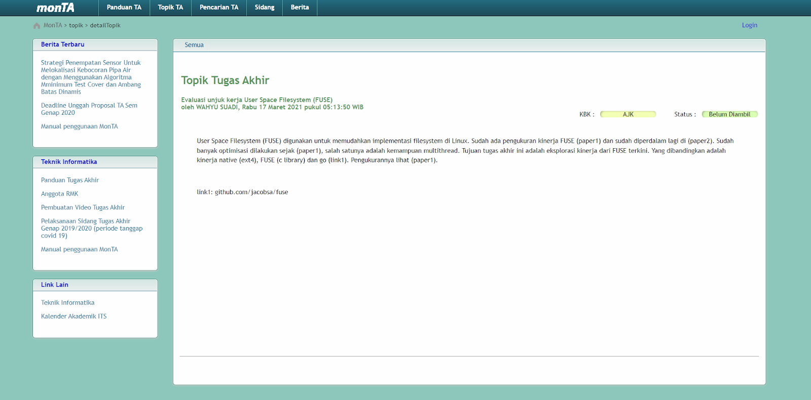

# Jarkom-Modul-1-A02-2022

- Ferdinand Putra Gumilang Silalahi - 5025201176
- Naufal Adli Purnama - 5025201195
- Bimantara Tito Wahyudi - 5025201227

1. Sebutkan web server yang digunakan pada "monta.if.its.ac.id"!
   
   ###### Jawab
    
    Digunakan display filter untuk mendapatkan semua paket yang menuju atau berasal dari "monta.if.its.ac.id":
    ``` 
    http.response or http.host eq "monta.if.its.ac.id 
    ```

   ###### Dokumentasi
   

1. Ishaq sedang bingung mencari topik TA untuk semester ini, lalu ia datang ke website monta dan menemukan detail topik pada website “monta.if.its.ac.id”, judul TA apa yang dibuka oleh Ishaq?
   
   ###### Jawab
    
    Digunakan display filter untuk mendapatkan semua paket dari "monta.if.its.ac.id" yang mengandung string "detailtopik" (case-insensitive):
    ```
    (http.response or http.host eq "monta.if.its.ac.id") and lower(http.request.uri) contains "detailtopik"
    ```

   ###### Dokumentasi
   
   
   

1. Filter sehingga wireshark hanya menampilkan paket yang menuju port 80!
   
   ###### Jawab
    
    Digunakan display filter untuk mendapatkan semua paket yang menuju port 80:
    ```
    tcp.destport == 80 || udp.dstport == 80
    ```

   ###### Dokumentasi
   

1. Filter sehingga wireshark hanya mengambil paket yang berasal dari port 21!
   
   ###### Jawab
    
    Digunakan display filter untuk mendapatkan semua paket yang berasal dari port 21:
    ```
    tcp.srcport == 21 || udp.srcport == 21
    ```

   ###### Dokumentasi
   

1. Filter sehingga wireshark hanya mengambil paket yang berasal dari port 443!
   
   ###### Jawab
    
    Digunakan display filter untuk mendapatkan semua yang berasal dari port 443:
    <br>
    ```
    tcp.srcport == 443 || udp.srcport == 443
    ```

   ###### Dokumentasi
   

1. Filter sehingga wireshark hanya menampilkan paket yang menuju ke lipi.go.id!
   
   ###### Jawab
    
    Pertama, untuk mengidentifikasi alamat dari laman "lipi.go.id" digunakan display filter:
    ```
    http contains "lipi"
    ```
    Didapatkan ip address `203.160.128.158`.
    <br>
    Selanjutnya ip address digunakan untuk mendapatkan semua paket yang menuju ke laman "lipi.go.id":
    ```
    ip.dst == 203.160.128.158
    ```

   ###### Dokumentasi
   
   

1. Filter sehingga wireshark hanya mengambil paket yang berasal dari ip kalian!
   
   ###### Jawab
    
    Digunakan capture filter untuk mendapatkan semua paket yang berasal dari ip perangkat:
    ```
    src host 192.160.0.27
    ```

   ###### Dokumentasi
   

Untuk soal 8-10, silahkan baca cerita di bawah ini!

Di sebuah planet bernama Viltrumite, terdapat Kementerian Komunikasi dan Informatika yang baru saja menetapkan kebijakan baru. Dalam kebijakan baru tersebut, pemerintah dapat mengakses data pribadi masyarakat secara bebas jika memang dibutuhkan, baik dengan maupun tanpa persetujuan pihak yang bersangkutan. Sebagai mahasiswa yang sedang melaksanakan program magang di kementerian tersebut, kalian mendapat tugas berupa penyadapan percakapan mahasiswa yang diduga melakukan tindak kecurangan dalam kegiatan Praktikum Komunikasi Data dan Jaringan Komputer 2022. Selain itu, terdapat sebuah password rahasia (flag) yang diduga merupakan milik sebuah organisasi bawah tanah yang selama ini tidak sejalan dengan pemerintahan Planet Viltrumite. Tunggu apa lagi, segera kerjakan tugas magang tersebut agar kalian bisa mendapatkan pujian serta kenaikan jabatan di kementerian tersebut!

8. Telusuri aliran paket dalam file .pcap yang diberikan, cari informasi berguna berupa percakapan antara dua mahasiswa terkait tindakan kecurangan pada kegiatan praktikum. Percakapan tersebut dilaporkan menggunakan protokol jaringan dengan tingkat keandalan yang tinggi dalam pertukaran datanya sehingga kalian perlu menerapkan filter dengan protokol yang tersebut.
   
   ###### Jawab
   Digunakan display filter untuk mendapatkan semua paket yang menggunakan protokol TCP:
    ```
    tcp
    ```
    Karena pesan yang dikirim kemungkinan panjang, hasil capture diurutkan berdasarkan panjang paket yang paling besar.
    <br>
    Ditemukan dua ip suspek, yaitu `127.0.0.1` dan `127.0.1.1`. Digunakan filter ip address untuk memudahkan penelusuran perbincangan: 
    ```
    ip.addr == 127.0.0.1 and ip.addr == 127.0.1.1 and tcp.len > 0
    ```

   ###### Dokumentasi
   
   
   
   
   

1. Terdapat laporan adanya pertukaran file yang dilakukan oleh kedua mahasiswa dalam percakapan yang diperoleh, carilah file yang dimaksud! Untuk memudahkan laporan kepada atasan, beri nama file yang ditemukan dengan format [nama_kelompok].des3 dan simpan output file dengan nama “flag.txt”.
   
   ###### Jawab
    
    Digunakan display filter untuk mendapatkan semua paket yang menggunakan protokol TCP:
    ```
    tcp
    ```
    Karena pesan yang dikirim kemungkinan panjang, hasil capture diurutkan berdasarkan panjang paket yang paling besar.
    <br>
    Ditemukan dua ip suspek, yaitu `127.0.0.1` dan `127.0.1.1`. Digunakan filter ip address untuk memudahkan penelusuran perbincangan: 
    ```
    ip.addr == 127.0.0.1 and ip.addr == 127.0.1.1 and tcp.len > 0
    ```

   ###### Dokumentasi
   

2. Temukan password rahasia (flag) dari organisasi bawah tanah yang disebutkan di atas!
   
   ###### Jawab
    
    Berdasarkan clue dari percakapan dan ilmu wibu yang ekstensif, didapatkan password file, yaitu `nakano`.

   ###### Dokumentasi
   
